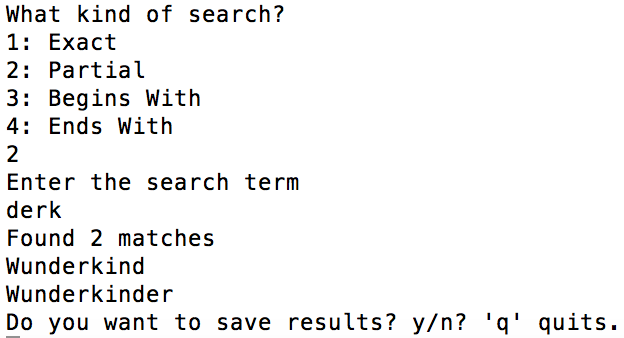

#  Scrabble Word Finder

It is a simple CLI application in RUBY which loads a dictionary file and uses a simple parser that will search for words within it.

* dictionary_loader.rb - Loads the dictionary 5desk.txt or any file user choose from a disk
* dictionary_searcher.rb - runs search by words starting or ending with specific letter or letters being inside a word
* dictionary.rb - displays statistics of words in dictionary (ie. how many latters beginig with 'Z')
* dictionary_ui.rb - main file to run Scrabble Word Finder




## Getting Started

If you want to quick run some the examples to see the code in action, run
```
$ ruby dictionary_ui.rb
```
from the project directory.

## Authors

* **Dariusz Biskupski** - *Initial work* - https://dariuszbiskupski.com


## Acknowledgments

It is part of the assignment created for [Viking Code School](https://www.vikingcodeschool.com/)
